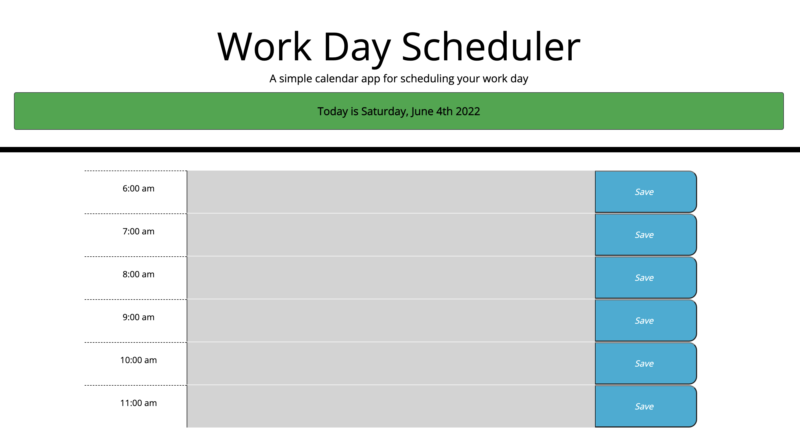

# Work-Day-Scheduler

## GT Bootcamp - Module 5 Challenge: Work Day Scheduler

This week we were given some starter code to work with. Our challenge was to build a simple daily calendar application that allows the user to set appointments that persist even when the page is reloaded. This obviously involved using local storage, which was not new. But what was new, and what ended up being the most difficult task to accomplish, was how to set up multiple dynamically created elements with their own unique submit buttons.

I spent a lot of time on this part of the challenge. I started trying multiple different ways of approaching the problem, most of which wouldn't have worked. It was actually really hard to think of a way to pair together specific elements in the javascript without hard coding them. Eventually I settled on using the ID of the parent element to pair the submit button to its corresponding text field. This actually was a surprisingly simple solution, despite taking me some time to figure out.

The rest of the challenge involved using Moment to set up the both the current date at the top of the page, as well as using the current hour to color code the time blocks in the past present or future. This was actually one of the simplest parts of the challenge, and it demonstrates how well third party APIs can simplify and streamline the development process.

Since the CSS framework was already given to us, that was pretty straightforward. This challenge was the first to incorporated a CSS framework, in this case Bootstrap. While there was a bit of a learning curve, it definitely simplified the CSS portion of the site.

## [Deployed Application](https://mmmphoto.github.io/Work-Day-Scheduler/)
## [Github Respository](https://github.com/MMMPhoto/Work-Day-Scheduler)

#### © 2022 Max McDonough

